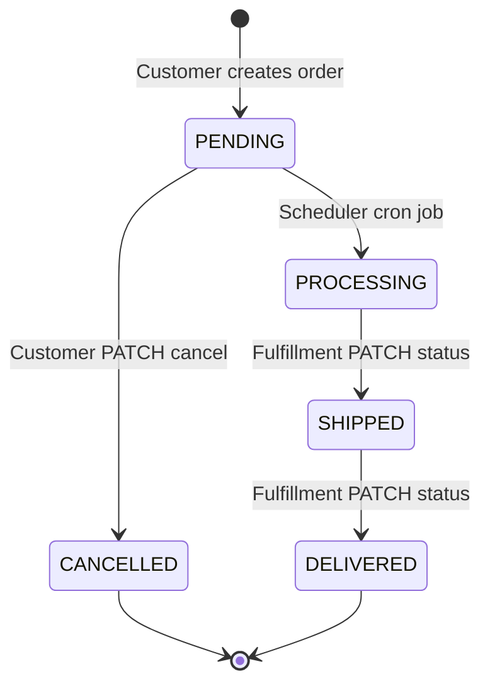

# Order Processing System

NestJS backend for an e-commerce order processing system. Customers register, authenticate with JWT, place orders, list and track them, and cancel while still `PENDING`. A background scheduler promotes `PENDING` orders to `PROCESSING` on a configurable cron schedule. Fulfillment staff can advance orders to `SHIPPED` and `DELIVERED` via a lightweight admin-key endpoint.

## Tech stack

- **NestJS 11** · **TypeScript** · **PostgreSQL** · **TypeORM** (migrations, no `synchronize`)
- **JWT + Passport** for customer authentication
- **@nestjs/schedule** for background jobs
- **Swagger** at `/docs` · **Jest** unit tests

## Prerequisites

- Node.js 20+
- PostgreSQL running locally
- Copy `.env.example` → `.env` and adjust DB credentials

## Quick start

```bash
npm install
npm run migration:run
npm run start:dev
```

| URL | Purpose |
|-----|---------|
| http://localhost:8080/api | REST API (global prefix) |
| http://localhost:8080/api | Swagger UI |

## Environment variables

See [`.env.example`](.env.example). Key settings:

| Variable | Description |
|----------|-------------|
| `DB_*` | PostgreSQL connection |
| `JWT_SECRET` | Signing key (min 16 chars) |
| `ORDERS_PROCESS_PENDING_CRON` | Cron for PENDING → PROCESSING (default `*/5 * * * *`) |
| `ADMIN_API_KEY` | Shared secret for fulfillment status updates (`X-Admin-Key` header) |

## Assignment requirements — coverage

| Requirement | Endpoint / mechanism | Status |
|-------------|---------------------|--------|
| Create order (multiple items) | `POST /api/orders` | Implemented |
| Retrieve order by ID | `GET /api/orders/:id` | Implemented |
| List orders, filter by status | `GET /api/orders?status=` | Implemented |
| Cancel order (PENDING only) | `PATCH /api/orders/:id/cancel` | Implemented |
| Auto PENDING → PROCESSING (every 5 min) | `OrdersScheduler` + `ORDERS_PROCESS_PENDING_CRON` | Implemented |
| Status lifecycle enum | `PENDING`, `PROCESSING`, `SHIPPED`, `DELIVERED`, `CANCELLED` | Implemented |

## API reference

### Auth (public)

| Method | Path | Description |
|--------|------|-------------|
| POST | `/api/auth/register` | Register customer → returns JWT |
| POST | `/api/auth/login` | Login → returns JWT |
| GET | `/api/auth/me` | Current user (Bearer token) |

### Orders (JWT required — `Authorization: Bearer <token>`)

| Method | Path | Description |
|--------|------|-------------|
| POST | `/api/orders` | Place order |
| GET | `/api/orders` | List my orders (`?status=`, `?skip=`, `?limit=`, `?order=`) |
| GET | `/api/orders/:id` | Order details + line items |
| PATCH | `/api/orders/:id/cancel` | Cancel own PENDING order |

### Fulfillment (admin key — `X-Admin-Key: <ADMIN_API_KEY>`)

| Method | Path | Description |
|--------|------|-------------|
| PATCH | `/api/orders/:id/status` | Advance order: `PROCESSING → SHIPPED → DELIVERED` |

**Sample inventory** (in-memory, for demo):

| Product | Stock | Price |
|---------|-------|-------|
| iPhone 16 | 5 | 80000 |
| AirPods Pro | 0 (out of stock) | 20000 |
| MacBook Pro | 3 | 150000 |

## Order lifecycle



### Implemented vs intentionally deferred

| Transition | Actor | Implementation |
|------------|-------|----------------|
| → PENDING | Customer | `POST /api/orders` |
| PENDING → PROCESSING | System scheduler | `OrdersScheduler` |
| PENDING → CANCELLED | Customer | `PATCH /api/orders/:id/cancel` |
| PROCESSING → SHIPPED | Fulfillment / admin | `PATCH /api/orders/:id/status` + `X-Admin-Key` |
| SHIPPED → DELIVERED | Fulfillment / admin | Same endpoint |

**Deferred (out of assignment scope):** full admin UI, product catalog module, persistent inventory, Docker, role-based JWT for admins.

## Why JWT?

The assignment refers to **customers** placing and managing orders. JWT scopes every order operation to the authenticated user:

- List **only my** orders
- Cancel **only my** orders
- `403 Forbidden` when accessing another customer's order ID

See [docs/JWT_NARRATIVE.md](docs/JWT_NARRATIVE.md) for the interview talking points.

## Live demo script

Step-by-step Swagger walkthrough for interviews: [docs/DEMO.md](docs/DEMO.md).

## Tests

```bash
npm test          # unit tests
npm run test:cov  # with coverage
npm run lint
npm run build
```

**20 unit tests** covering `OrdersService` (create, inventory validation, cancel, scheduler hook) and `AuthService` (register, login, duplicate email, invalid credentials).

## Cursor / AI usage

This project was built with extensive use of **Cursor AI** as a pair programmer:

| Area | AI helped with | Issue encountered | Resolution |
|------|----------------|-------------------|------------|
| Bootstrap | NestJS structure, ConfigModule, TypeORM migrations | CLI scaffolded into wrong directory; duplicate migrations | Moved files; kept single clean migration |
| Auth | JWT module, guards, DTOs | `JwtModule` `expiresIn` type mismatch; 500 on missing DB columns | Type cast; ran migrations |
| Orders | Entities, pagination, cancel, scheduler | Swagger 404; over-abstracted InventoryService | Fixed swagger path; inlined inventory |
| Tests | TypeORM transaction mocks | ESLint `unbound-method` in specs | Hoisted jest mocks to local variables |

AI accelerated boilerplate and caught NestJS patterns early; all design decisions, debugging, and final code review were validated manually.

## Project structure

```
src/
├── auth/           # JWT register, login, guards
├── users/          # User entity + service
├── orders/         # Orders API, scheduler, fulfillment
├── config/         # Env validation, app/database/jwt config
├── database/       # TypeORM factory, migrations, CLI data-source
└── common/         # Shared enums, guards, transformers
```
